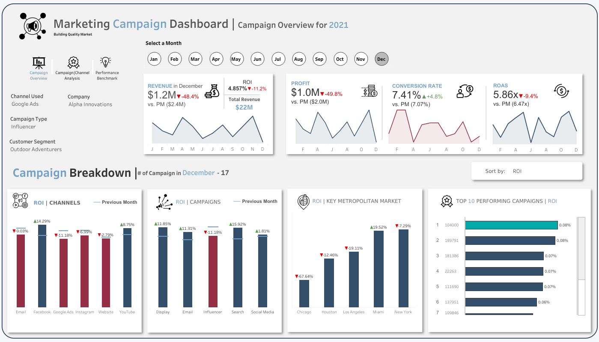
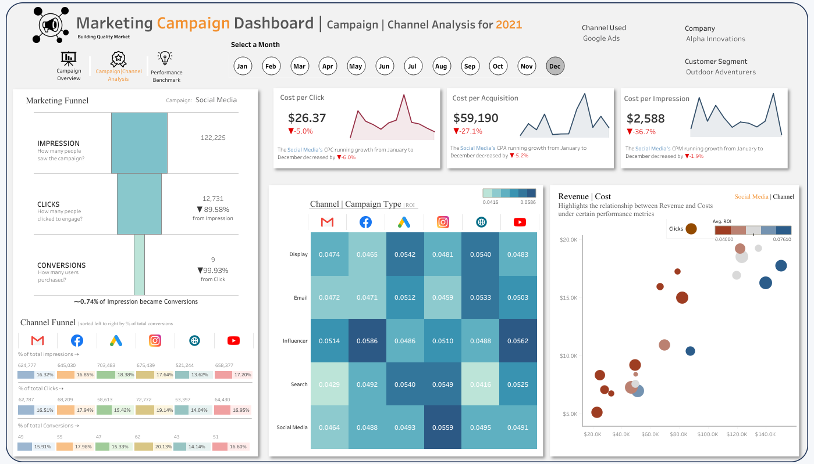
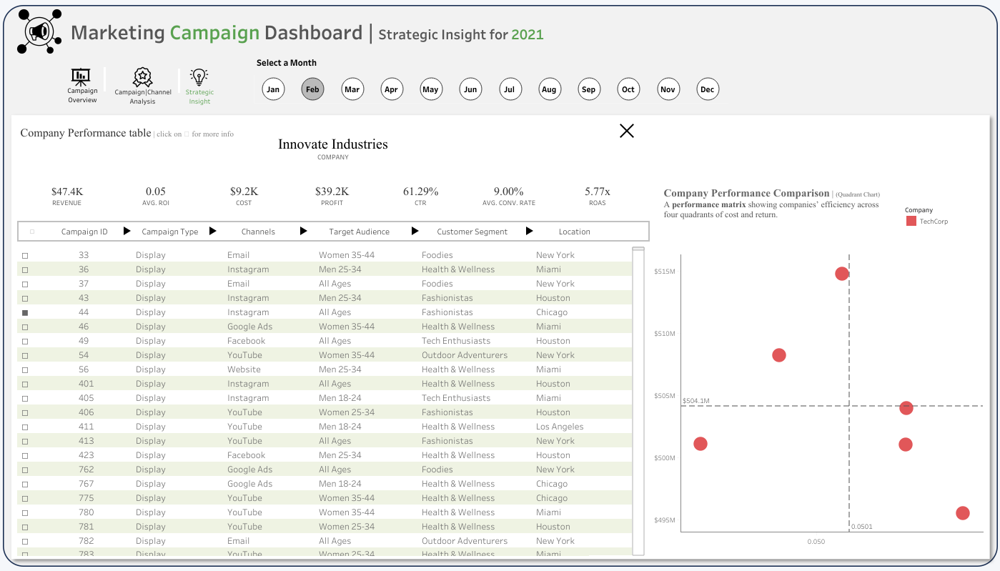

# 📊 Marketing Campaign Performance Dashboard (2021)

## Executive Summary
This project analyzes the performance of multiple marketing campaign types to identify which strategies deliver the strongest business outcomes. By evaluating key marketing and financial metrics, the analysis provides data-driven insights to support budget allocation, campaign optimization, and strategic decision-making.

The dashboards translate complex marketing data into **clear, visual insights** that support:
- Budget allocation decisions
- Channel performance evaluation
- Campaign optimization strategies

The focus is on **clarity, storytelling, and executive usability**, not just technical analysis.

---

## 🎯 Business Objectives
The project was designed to answer the following key business questions:

- Which marketing campaigns and channels deliver the highest ROI?
- How efficiently do impressions convert into clicks and conversions?
- Which channels drive engagement versus profitability?
- How does performance vary by campaign type, location, and audience segment?
- Where should marketing spend be optimized or reallocated?

---

## 📈 Marketing Campaign Performance (Insight into MARKETING CAMPAIGN)

- The marketing campaign portfolio demonstrates strong and consistent profitability. From a total investment of approximately **$2.5B**, the campaigns generated **$15.02B** in **revenue**, resulting in about **$12.5B** in **profit** and an overall **ROI of 5%**. This indicates that current marketing efforts are financially sustainable and operationally effective.

- At the **Channel** level, `Facebook` emerged as the most efficient platform, delivering the `highest ROI (5.02%)` alongside the strongest engagement, with a `click-through rate` of `14.05%`. This combination suggests Facebook is well-positioned for scaling future campaigns without sacrificing efficiency.

- From a **Campaign-type** perspective, `Display campaigns` particularly those delivered via `Email` performed best overall. This combination achieved the `highest ROI (5.03%)` and the `highest average revenue per campaign ($75.8K)`, highlighting the effectiveness of pairing visually driven content with direct audience reach.

- Conversely, `Email campaigns` distributed through `YouTube` recorded the `lowest ROI (4.96%)`, suggesting a misalignment between the channel and campaign format. These campaigns may benefit from redesign or reallocation toward higher-performing channels such as Facebook or Display.

- Customer segmentation analysis shows that the **“Foodies”** segment contributed the `highest total revenue ($3.03B)`. This presents a clear opportunity to deepen engagement with this audience through more targeted messaging and cross-category promotional strategies.

- While overall profitability remains stable, conversion rates across campaign types are relatively low (approximately 0.08%), indicating a key area for optimization. Enhancements to landing page experience, personalization, and call-to-action clarity could drive meaningful performance improvements without increasing total marketing spend.

- Overall, the findings suggest the organization is operating within a mature and efficient marketing ecosystem. Future growth is more likely to come from improving conversion efficiency, optimizing cost structures, and prioritizing high-value customer segments, rather than simply increasing media spend.

---

## 📌 Dashboard Overview
#### The Tableau Dashboard used to visualize the analysis can be found here →[Link to MARKETING CAMPAIGN Dashboard](https://public.tableau.com/views/Book1_17605414759400/CAMPAIGNOVERVIEW?:language=en-US&publish=yes&:sid=&:redirect=auth&:display_count=n&:origin=viz_share_link)

### 1️⃣ Campaign Overview Dashboard

**Purpose**
The Campaign Overview dashboard provides a high-level snapshot of overall marketing performance for a selected month. It is designed to be the first point of reference for stakeholders who want to quickly assess whether campaigns are performing as expected.

This view focuses on core financial and efficiency metrics and highlights month-over-month changes to help identify early signs of improvement or decline.

Business Questions Answered
- Are marketing campaigns generating positive returns overall?
- How does current performance compare to the previous month?
- Are revenue and profit trending upward or downward?
- Is marketing spend converting efficiently into results?

**Key Metrics**
- Revenue
- Profit
- Return on Investment (ROI)
- Conversion Rate
- Return on Ad Spend (ROAS)

---

### 2️⃣ Campaign & Channel Analysis Dashboard

**Purpose**
The Campaign & Channel Analysis dashboard is used to break down performance by channel and campaign type. While the overview dashboard shows what is happening, this view helps explain why it is happening.

It analyzes the customer journey from impressions to clicks to conversions and evaluates cost efficiency across channels. This dashboard supports tactical optimization decisions, such as budget reallocation and channel prioritization.

**Business Questions:**
- Which channels and campaign types deliver the highest ROI?
- Where are users dropping off in the marketing funnel?
- Which channels are most cost-efficient in terms of CPC and CPA?
- Does higher spend consistently translate into higher returns?

**Key Metrics**
- Impressions → Clicks → Conversions
- Cost per Click (CPC)
- Cost per Acquisition (CPA)
- Cost per Mille (CPM)
- Revenue vs Cost
- ROI by Channel and Campaign Type

---

### 3️⃣ Performance Benchmarking Dashboard

**Purpose**
The Performance Benchmarking Dashboard is designed to support performance benchmarking and strategic decision-making at both aggregate and individual company levels.
At the default (All Companies) view, the dashboard provides a comparative overview of how different companies perform relative to one another in terms of cost efficiency and return.

When a specific company is selected, the dashboard transitions into a focused performance profile, allowing stakeholders to examine that company’s revenue, cost, profit, ROI, engagement, and conversion metrics in detail.

**Business Questions**
At the Overall View (All Companies)
- Which company is generating the strongest returns relative to cost?
- Are some companies operating more efficiently than others?
- Which companies fall into high-return vs low-return quadrants?
- Where should additional marketing investment be considered?

**Key Metrics Tracked:**
- Revenue
- Cost
- Profit
- Return on Investment (ROI)
- Return on Ad Spend (ROAS)
- Click-Through Rate (CTR)
- Average Conversion Rate
- Revenue vs Cost quadrant positioning

---

## 🧠 Business Recommendation based on Analysis
- Increase Investment in High-ROI Campaigns Campaigns with an ROI above 5.0 should receive higher budget allocation as they demonstrate strong returns.
- Reduce spending on campaigns with an ROI below 2.0, as they may not be cost-effective.
- Enhance Click-Through Rate (CTR) with Better Targeting Campaigns with CTR above 10% indicate high engagement and should be expanded to similar audience segments.
- Refine Location-Based Marketing Strategies Cities like Miami and Los Angeles had the highest CTR (~10%) and ROI (~5.0+), indicating strong audience engagement.
- Locations with lower CTR (<7%) need more localized content or different targeting approaches.
- Target High-Performing Demographics More Effectively Campaigns targeting Women 25-34 and Men 18-24 had the highest CTR (~14%), making them ideal segments for expansion.
- Age groups or demographics with lower engagement should be re-evaluated for content relevance and platform suitability.

---

## 🛠 Tools & Technologies
- Power BI (Dashboard Design & Visualization)
- Python (Data preparation & analysis)
- Pandas, Matplotlib, Seaborn
- Scikit-learn (Metric normalization)
- Google Colab

---

## 📚 Project Files

- [`Google Colab Link`](https://colab.research.google.com/drive/16o2qcKG3pQvaqBpq2bRKa4La3oHLDGMT?usp=sharing)  
- [`link to Marketing Campaign dashboard`](https://public.tableau.com/views/Book1_17605414759400/CAMPAIGNOVERVIEW?:language=en-US&publish=yes&:sid=&:redirect=auth&:display_count=n&:origin=viz_share_link)

---

## 📬 Author
**Mishael Alelume**  
Data Analyst | Share you view on this project
